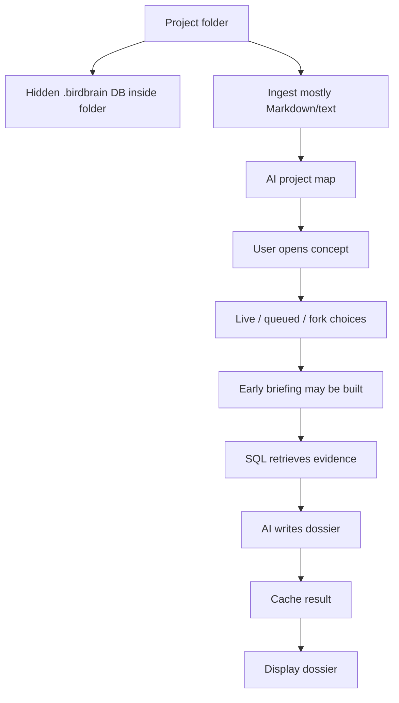
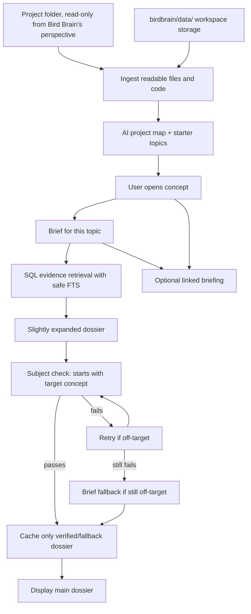

# Bird Brain Architecture: Before vs After

This is the quick demo-facing version of what changed and why it matters.

## One-Sentence Difference

Before, Bird Brain behaved like several overlapping AI paths over a Markdown-ish folder. After, it is a cleaner local project reading tool: readable files are saved into app-owned SQLite storage, each topic gets a brief, and the final dossier grows from that brief instead of starting over.

## Side-By-Side Summary

| Area | Before | After |
| --- | --- | --- |
| Storage | Each project folder could get its own hidden `.birdbrain/app.db`. | Bird Brain stores app data in `birdbrain/data/`, with workspace DBs in `data/workspace-dbs/`. |
| Source folder behavior | Reading a folder also wrote Bird Brain state into that folder. | Reading a folder no longer creates hidden state inside the source folder. |
| Registry | Workspace registry lived in hidden home storage. | Active registry lives at `birdbrain/data/workspaces.json`. |
| File support | Product language and comments still implied "Markdown only." | UI and prompts now describe readable files: Markdown, text, structured text, HTML/XML, SVG, and source code. |
| Code ingestion | Source code was opt-in by default. | Source code is included by default, while dependency/build folders remain skipped. |
| Main dossier mode | Live and queued were both visible concepts. | Queued is the main dossier experience. |
| Lightweight mode | Forked live spanify was hidden behind the live-mode idea. | Linked briefing is the optional lightweight mode. |
| AI interpretation | Later prompts could rediscover or reinterpret the same topic. | The brief is treated as the topic anchor before the dossier is written. |
| Dossier shape | The final dossier could become a second, broader AI interpretation. | The final dossier is now a slightly deeper, hypertext-ready version of the brief. |
| Dossier stability | A related topic could dominate the paragraph, e.g. `Birdsong` starting as `Seaview...`. | Dossiers retry if they start with the wrong subject, then fall back to the brief instead of saving polluted output. |
| Search stability | SQLite FTS could error on terms like `ex-wife`, `town-sized`, or `Six-Perspective`. | FTS query terms are sanitized/tokenized before `MATCH`, so hyphenated concepts do not crash retrieval. |
| Dev server | `output: "standalone"` affected normal dev/build and caused `.next/dev` manifest weirdness. | Standalone output is only enabled for sidecar builds; `npm run dev` works normally again. |
| Default model | Cursor CLI defaulted to a Claude model. | Cursor CLI now defaults to `gpt-5.5-medium`. |
| Repo/data hygiene | Old caches and hidden workspace DBs made testing confusing. | Old hidden storage was removed; tests now run from clean `data/` storage. |

## Before Flow

Plain English: the old system mixed reading and storing in the same folder, exposed multiple writing routes, and let evidence-heavy neighboring topics sometimes take over the dossier.

## After Flow

Plain English: the new path has one serious dossier route. The brief defines what the topic is, search adds a few supporting details, and the final paragraph is not allowed to become a different topic's explanation.

## What "Brief" Means

The brief is the stable short answer for a topic. It answers:

- What is this topic?
- What role does it play in this project?
- Why does it matter?
- Which related topics help explain it?

The important rule is: Bird Brain should not ask every later prompt to rediscover this meaning from scratch. Dossiers, linked briefs, topic cards, and Ask-style answers should inherit from the same brief.

## Dossier Stability Rule

The dossier now has a simple safety rule:

If the user opens `Birdsong`, the generated paragraph must start with `Birdsong` or a Birdsong alias. A paragraph like `Seaview gives Birdsong...` is rejected because it is really starting as the Seaview dossier.

When that happens, Bird Brain retries once with a stricter instruction. If the retry still starts with the wrong subject, Bird Brain saves a shorter brief-based fallback instead of posting a confident but polluted paragraph.

Lite mode stays distinct: it does not deepen or rewrite the brief. It only turns the same brief text into clickable hypertext.

## What Changed In Code

| File | Change |
| --- | --- |
| `app/lib/workspaces/registry.ts` | Moves active workspace registry and DB paths to `birdbrain/data/`, with migration from old hidden `.birdbrain` locations. |
| `app/lib/engine/secrets.ts` | Moves local secrets fallback to `data/secrets.json`, with legacy copy support. |
| `app/components/WorkspacePicker.tsx` | Updates copy from Markdown-centric language to readable files and defaults source-code ingest on. |
| `app/lib/ingest/parse.ts` | Treats code as readable by default while still skipping dependency/build folders. |
| `app/lib/ingest/ingest.ts` | Remembers whether code files should be included, now defaulting to yes. |
| `app/lib/ontology/startup.ts` | Updates internal topic-finding prompts from "Markdown folder" to readable files/codebase language. |
| `app/components/DossierContext.tsx` | Defaults dossier state to queued and migrates stored live mode back to queued. |
| `app/components/Panorama.tsx` | Removes the top-level live/queued toggle and labels the system as primary queued dossiers. |
| `app/components/ConceptDossier.tsx` | Keeps "dossier" as the final product and "brief" as the stable short answer. |
| `app/app/api/dossier/[slug]/route.ts` | Treats queued as the default API mode unless live is explicitly requested. |
| `app/lib/ai/synthesize.ts` | Makes primary dossiers a slightly expanded brief, anchors prompts to that brief, retries off-target generations, and falls back safely if needed. |
| `app/lib/db/queries.ts` | Sanitizes SQLite FTS queries so hyphenated/special terms do not crash retrieval. |
| `app/next.config.ts` | Uses standalone output only for sidecar builds, fixing normal `next dev` and `next start` behavior. |
| `app/package.json` | Enables standalone only for `build:sidecar`. |
| `app/lib/engine/cursor-cli.ts` | Changes default Cursor CLI model to `gpt-5.5-medium`. |
| `app/app/api/engine/models/route.ts` | Adds `gpt-5.5-medium` to the curated model list. |

## Demo Explanation

For a hiring-manager demo, the simplest explanation is:

Bird Brain is a local-first project reading tool. It reads a project folder without modifying it, stores its own SQLite state inside the app's `data/` folder, builds a project map from the files, creates a brief for each topic, and then turns that brief into a slightly deeper hypertext dossier while checking that the dossier stays focused on the requested topic.

## Current Verification

- `npm run build` passes.
- `npm run dev` now starts cleanly and `localhost:3000` returns `200 OK`.
- `/api/search` no longer errors on `town-sized`, `ex-wife`, or `Six-Perspective`.
- Existing off-target queued dossier caches were audited and bad rows were deleted.
- Active workspace storage is in `birdbrain/data/workspaces.json` and `birdbrain/data/workspace-dbs/`.

## Why This Is Better

- No hidden Bird Brain state inside the folders being read.
- Less mode confusion.
- Less prompt redundancy.
- Less interpretation drift.
- Safer dossier posting when the model drifts.
- More reliable local search retrieval.
- A working dev server again.
- Easier to explain in a demo.
