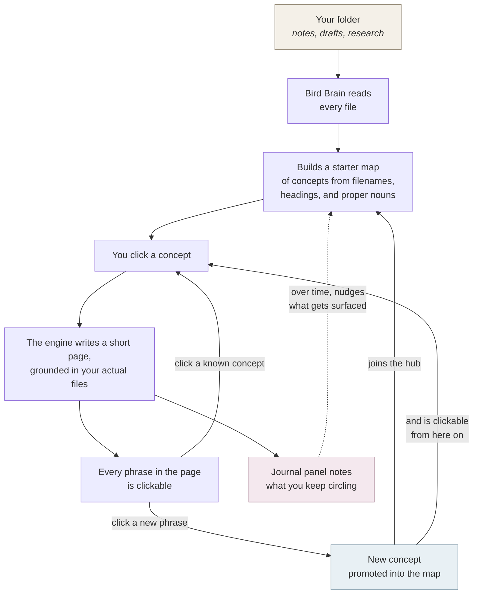

# Bird Brain

> A small local-first generative hypertext project journal. Point it at a
> project folder and it builds its own concept map, then lets you walk that map
> like a branching dialogue tree in a video game. Every generated
> paragraph is itself clickable within the 2010's-inspired metro UI.

**Bird Brain turns folders of text and code files into a generative
hypertext concept map for active work and research synthesis instead of
the traditional linear LLM conversation path.** You click a concept, it
writes a short page about that concept grounded in the actual files, and
every phrase in the page is itself clickable within the
2010's-inspired metro UI: either a link to another concept it already
recognizes, or a new one it thinks is worth noticing. Click a new one
and it joins the map. As you explore, the folder gradually transforms,
offering a new perspective on itself with each interaction.

## Why it exists

Over the weekend, the amount of files for the video game I'm working on
became unruly, and I wanted to see if I could make something that would
help me navigate it.

Nothing about my game is baked into the engine; it works with any
project folder and does the same thing. It's just that the inspiration
material happens to be my own: Bird Brain is a new interactive way to
see the abstract and messy archive I already have and turn it into
something easy for me and my collaborators to work with. **But it's
pointing the tool at a project I'm just beginning to learn about when
the tool is at its best.**

***

## The interaction model

Think branching dialogue trees in a video game, the kind where picking one 
option opens up new things to investigate, and picking *those new options* shifts the
state of the scene, affecting how players see the game world in an increasingly personalized lense as the story unfolds. 
**Bird Brain turns folders of text and code files into a generative hypertext concept map for active work and research synthesis instead of the traditional linear LLM conversation path.**

| In a dialogue-tree game                  | In Bird Brain                                                |
| ---------------------------------------- | ------------------------------------------------------------ |
| Opening a scene                          | Opening a project folder                                     |
| Initial dialogue options                 | The starter concept map, derived from the folder itself      |
| Picking a branch → new dialogue reveals  | Clicking a concept → a short generated page + new links      |
| "Investigate" points in the environment  | Clickable phrases inside the generated page                  |
| A choice permanently shifts the scene    | What you click on becomes part of the map                    |
| The in-game journal                      | The Journal panel - a running paragraph of what you're doing |

### Umwelten for archives: a perceptual framing

Bird Brain is designed to help you experience project files through a fresh lense. Instead of presenting a static summary, it adapts and reorganizes what you see based on the pathways you follow and the concepts you engage with. The map it builds isn’t hardcoded: it emerges entirely from your ongoing interactions with the material. As you explore and click through ideas, your personal journey shapes a unique perspective, one that grows more relevant and meaningful the more you use it. Over time, the archive isn't just organized; it becomes a living reflection of your attention and curiosity and relationship to the project.

***

## What ships today

Everything below runs locally against the current branch.

- **No hardcoded concepts.** Point Bird Brain at a folder and it derives
  its own starter concept list from filenames, headings, and proper
  nouns. No per-project config, nothing baked into the engine.
- **Generated pages as hypertext.** Click a concept and the engine
  writes a short paragraph about it. Every phrase in that page is either a
  link to a known concept, or a *candidate* the engine thinks deserves
  one of its own. Click a candidate and it becomes a real concept,
  joins the map, and gets its own page.
- **The map grows from attention.** Every click is logged. A running
  paragraph in the Journal panel reads those clicks back to you in
  plain prose — *"you keep circling X, Y, and the tension between
  them"* — and new concepts get promoted from whatever you keep
  hovering around.
- **Grounded in your files, not the model's memory.** Each page cites
  the actual documents it pulled from. A Sources strip sits under every
  page, with full evidence cards one click away, each of which opens
  the source file.
- **Two-stage generation.** Before writing the long page, the engine
  writes a short bird's-eye summary of what the concept is *inside this
  project*, then uses that as the spine for the real page. Cached per
  concept and thrown out when the files change.
- **Swappable engine.** Cursor Agent CLI is the default; OpenAI,
  Anthropic, and Ollama adapters are wired in. A settings drawer lets
  you pick provider and model without leaving the app, with a curated
  shortlist of newest-per-provider plus a "show all" toggle.
- **Desktop app.** A Tauri wrapper ships as a native macOS build. The
  web version is still fine for dev work, but the desktop app is the
  shape it's easiest to be used in.
- **Export.** Any generated page → Markdown, preserving hypertext links
  as stable references you can paste elsewhere.

## What is still partial

Honest list of things I haven't nailed yet:

- **Bridging text between pages.** When you navigate from concept A to
  concept B, B's page uses A as quiet context but doesn't *write the
  bridge*. The "here's how this follows from what you just read"
  feeling is still implicit.
- **No drift indicators.** Rising/fading markers over the concept map
  were cut as too noisy; may return once the click signal is richer.
- **Journal voice.** The "what you're circling" paragraph reads fine
  but is still more log than journal; a copy pass wouldn't hurt.
- **Copied-to-clipboard feedback.** When you export a generated hypertext page to Markdown, there's no visible signal yet that the text has been copied to your clipboard - some kind of confirmation/tell is still needed.
- **Workbench tab.** Still evaluating whether the Workbench tab meaningfully improves the user experience or just adds complexity. It may be streamlined or removed entirely if it proves unneeded.


***

## Quick start

```bash
cd app
npm install

npm run dev        # http://localhost:3000 —> pick a workspace folder in the UI

# Optional CLI ingest (defaults to the tiny tracked fixtures/smoke-corpus/):
# DOCS_PATH=/absolute/path/to/your/markdown npm run ingest
```

For live page generation, install the Cursor Agent CLI and run
`cursor-agent login`. If you'd rather use a different provider, the
background queue works the same way once you wire an adapter under
`app/lib/engine/`.

Desktop (Tauri) build: [`RUNNING_THE_PROTOTYPE.md`](RUNNING_THE_PROTOTYPE.md).

***

## How it works (the short version)



**The short read:** a folder goes in, a living map of concepts comes out.
The map grows from what you click. The pages are generated on demand
from the actual files, not from the model's general knowledge.

Everything is local. The files, the generated pages, and the map of
concepts all live on your machine. The only thing that leaves is the
small slice of text the model needs to write a page— and only if
you've pointed it at a remote model like Claude or GPT. Using a local
model (via Ollama) keeps the whole loop offline.

***

## Data model (today)

| Table                         | Role                                                              |
| ----------------------------- | ----------------------------------------------------------------- |
| `documents`, `chunks`         | Raw corpus + heading-delimited chunks                              |
| `chunks_fts`                  | FTS5 mirror for lexical retrieval                                  |
| `entities`, `entity_mentions` | Seeded + emerged concepts and their per-chunk mentions             |
| `concept_synthesis`           | Cached hypertextual paragraphs (live + queued profiles)            |
| `synthesis_queue`             | Background work list for queued synthesis                           |
| `ontology_runs`, `ontology_concepts`, `ontology_lenses` | LLM-assisted ontology overview          |
| `concept_precontext_cache`    | Bird's-eye precontext per concept, invalidated by corpus signature |
| `participation_sessions`, `participation_events` | Live click/read trail that feeds the memesis loop |
| `project_meta`                | Project name + engine config + guidance notes                       |

***

## Repo layout

```
birdbrain/
├── app/                       Next.js app + API routes + UI
│   ├── app/api/               dossier · concepts · search · hub · queue · …
│   ├── components/panels/     Hub, Workbench, Journal, Timeline (+ Concepts, Ask, Search)
│   ├── components/            ConceptDossier, DossierContext, StartupShell, …
│   ├── lib/ingest/            walker + parser + derive-concepts
│   ├── lib/db/                schema, queries, FTS helpers, migrations
│   ├── lib/ai/                synthesize, prompt builder, engine bridge
│   ├── lib/engine/            pluggable adapter (Cursor Agent CLI today)
│   ├── lib/ontology/          startup ontology overview
│   └── scripts/               ingest, synthesize-prep, eval-dossiers, smoke
├── src-tauri/                 desktop shell + sidecar packaging
├── RUNNING_THE_PROTOTYPE.md   web + desktop runbook
└── README.md                  (this file)
```

## License

Private. For personal and collaborator use.
