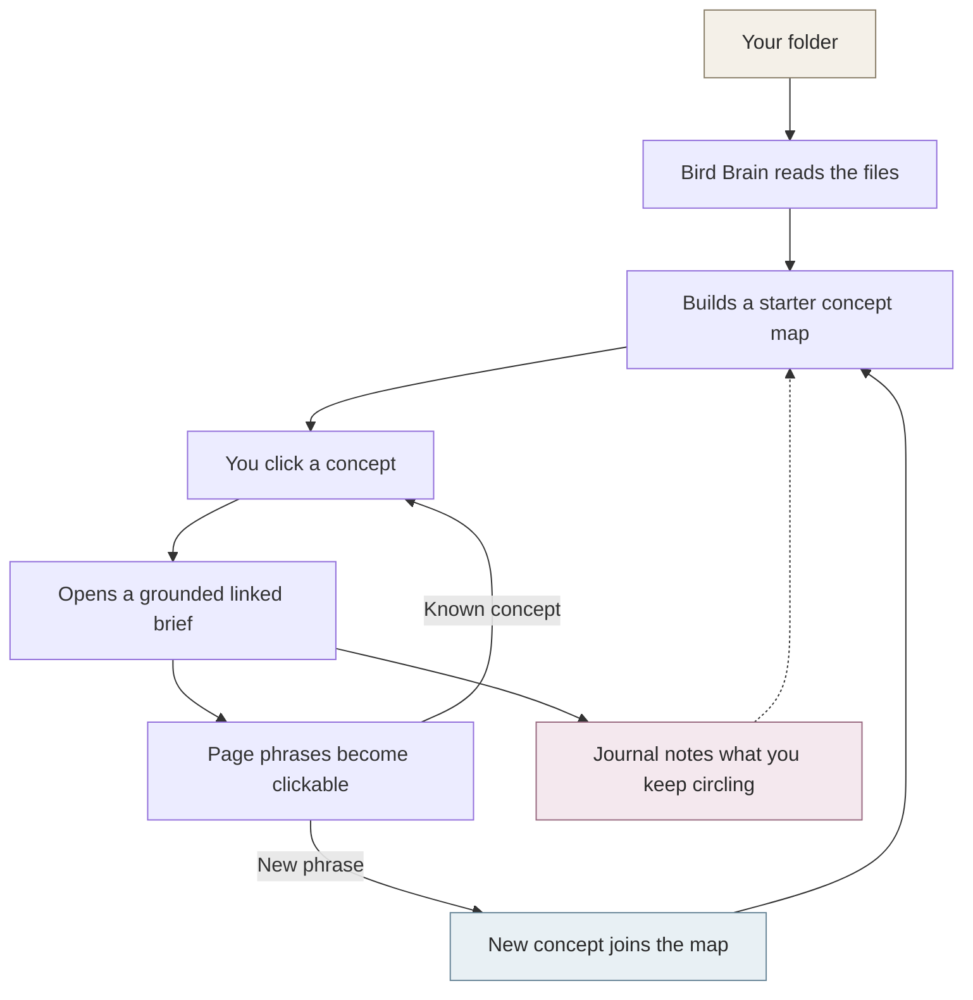
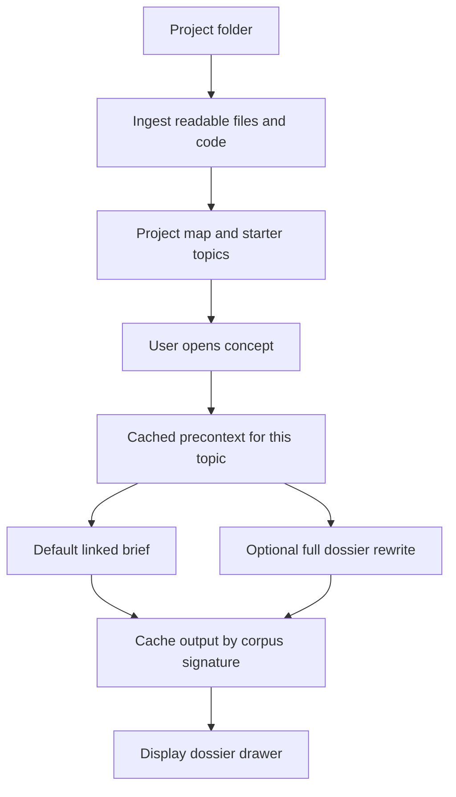

# Bird Brain

> A local-first hypertext project reader. Point it at a project folder, let it
> build a concept map, then walk that map like a branching dialogue tree in a
> video game. Every brief is clickable inside a 2010s-inspired metro UI.

**Bird Brain turns folders of text and code files into a generative
hypertext concept map for active work and research synthesis instead of
the traditional linear LLM conversation path.** You click a concept, it
writes a short page about that concept grounded in the actual files, and
every phrase in the page is itself clickable within the
2010's-inspired metro UI: either a link to another concept it already
recognizes, or a new one it thinks is worth noticing. Click a new one
and it joins the map. As you explore, the folder gradually transforms,
offering a new perspective on itself with each interaction.

## Why it exists

Over the weekend, the amount of files for the video game I'm working on
became unruly, and I wanted to see if I could make something that would
help me navigate it.

Nothing about my game is baked into the engine; it works with any
project folder and does the same thing. It's just that the inspiration
material happens to be my own: Bird Brain is a new interactive way to
see the abstract and messy archive I already have and turn it into
something easy for me and my collaborators to work with. **But it's
pointing the tool at a project I'm just beginning to learn about when
the tool is at its best.**

---

## The interaction model

Think branching dialogue trees in a video game, the kind where picking one 
option opens up new things to investigate, and picking *those new options* shifts the
state of the scene, affecting how players see the game world in an increasingly personalized lense as the story unfolds. 
**Bird Brain turns folders of text and code files into a generative hypertext concept map for active work and research synthesis instead of the traditional linear LLM conversation path.**


| In a dialogue-tree game                 | In Bird Brain                                                |
| --------------------------------------- | ------------------------------------------------------------ |
| Opening a scene                         | Opening a project folder                                     |
| Initial dialogue options                | The starter concept map, derived from the folder itself      |
| Picking a branch → new dialogue reveals | Clicking a concept → a short generated page + new links      |
| "Investigate" points in the environment | Clickable phrases inside the generated page                  |
| A choice permanently shifts the scene   | What you click on becomes part of the map                    |
| The in-game journal                     | The Journal panel - a running paragraph of what you're doing |


### Umwelten for archives: a perceptual framing

Bird Brain is designed to help you experience project files through a fresh lense. Instead of presenting a static summary, it adapts and reorganizes what you see based on the pathways you follow and the concepts you engage with. The map it builds isn’t hardcoded: it emerges entirely from your ongoing interactions with the material. As you explore and click through ideas, your personal journey shapes a unique perspective, one that grows more relevant and meaningful the more you use it. Over time, the archive isn't just organized; it becomes a living reflection of your attention and curiosity and relationship to the project.

---

## How it works (the short version)




**The short read:** a folder goes in, a living map of concepts comes out.
The map grows from what you click. Briefs are grounded in the actual files, not
the model's general knowledge.

### Under the hood: ingest → overview → linked brief

Your project folder is only **read**; app state (SQLite, registry) lives in
`data/`, not inside the source tree. Ingest stores documents and chunks, startup
builds an overview plus starter lenses, and opening a concept uses a cached
**precontext** as the spine for the default linked brief. The full dossier
rewrite path is still available from the dossier engine toggle when you want a
heavier synthesis pass.




Everything is local by default. The files, cached briefs, and map of concepts
live on your machine. Text only leaves the machine if you configure a remote AI
provider such as Cursor CLI, OpenAI, or Anthropic. Demo Mode and Ollama
keep the loop offline.

Bird Brain's own workspace databases and registry live under the repo's
`data/` folder by default (`data/workspaces.json` + `data/workspace-dbs/`).
Set `BIRDBRAIN_DATA_DIR` if you want that metadata somewhere else; older
installs may still have a legacy `~/.birdbrain/` folder that gets merged in
on first launch.

---

## Data model (today)


| Table                                                   | Role                                                               |
| ------------------------------------------------------- | ------------------------------------------------------------------ |
| `documents`, `chunks`                                   | Raw corpus + heading-delimited chunks                              |
| `chunks_fts`                                            | FTS5 mirror for lexical retrieval                                  |
| `entities`, `entity_mentions`                           | Seeded + emerged concepts and their per-chunk mentions             |
| `concept_synthesis`                                     | Cached hypertextual paragraphs (live + queued profiles)            |
| `synthesis_queue`                                       | Background work list for queued synthesis                          |
| `ontology_runs`, `ontology_concepts`, `ontology_lenses` | LLM-assisted ontology overview                                     |
| `concept_precontext_cache`                              | Bird's-eye precontext per concept, invalidated by corpus signature |
| `participation_sessions`, `participation_events`        | Live click/read trail that feeds the memesis loop                  |
| `project_meta`                                          | Project name + engine config + guidance notes                      |

---

## What ships today

Everything below runs locally against the current branch.

- **No hardcoded concepts.** Point Bird Brain at a folder and it derives
its own starter concept list from filenames, headings, and proper
nouns. No per-project config, nothing baked into the engine.
- **Generated pages as hypertext.** Click a concept and the engine
writes a short paragraph about it. Every phrase in that page is either a
link to a known concept, or a *candidate* the engine thinks deserves
one of its own. Click a candidate and it becomes a real concept,
joins the map, and gets its own page.
- **The map grows from attention.** Every click is logged. A running
paragraph in the Journal panel reads those clicks back to you in
plain prose — *"you keep circling X, Y, and the tension between
them"* — and new concepts get promoted from whatever you keep
hovering around.
- **Grounded in your files, not the model's memory.** Each page cites
the actual documents it pulled from. A Sources strip sits under every
page, with full evidence cards one click away, each of which opens
the source file.
- **Two-stage generation.** Before writing the dossier, the engine writes
a short bird's-eye **brief** of what the concept is *inside this project*,
then uses that as the spine for the dossier. Cached per concept and
thrown out when the files change.
- **Swappable engine.** Cursor Agent CLI is the default; OpenAI,
Anthropic, and Ollama adapters are wired in. A settings drawer lets
you pick provider and model without leaving the app, with a curated
shortlist of newest-per-provider plus a "show all" toggle.
- **Desktop app.** A Tauri wrapper ships as a native macOS build. The
web version is still fine for dev work, but the desktop app is the
shape it's easiest to be used in.
- **Bundled demo workspace.** Packaged builds include a prebuilt **Bird Brain
Demo** workspace with cached linked briefs, so users can explore concepts and
dossiers before configuring AI.
- **Export.** Copy the generated dossier **paragraph** as plain text to clipboard.
- **Possible evidence conflicts (v1).** Sometimes two passages about the same
concept *sound* like they’re saying opposite things (for example, one file
talks about a single point of view and another about dual POV, or one says
one playable character and another says two). Bird Brain can flag a few of
those pairs as “maybe look at this”—shown as a **Possible conflicts** line
on the dossier. It’s pattern-matching on wording, not “understanding” your
project, and it may miss real problems or show false alarms. It only
reports a handful of cases. Treat it as a
nudge, not a verdict.

## What is still partial

Honest list of things I haven't nailed yet:

- **Bridging text between pages.** When you navigate from concept A to
concept B, B's page uses A as quiet context but doesn't *write the
bridge*. The "here's how this follows from what you just read"
feeling is still implicit.
- **No drift indicators.** Rising/fading markers over the concept map
were cut as too noisy; may return once the click signal is richer.
- **Journal voice.** The "what you're circling" paragraph reads fine
but is still more log than journal; a copy pass wouldn't hurt.
- **Workbench tab.** Still evaluating whether the Workbench tab meaningfully improves the user experience or just adds complexity. It may be streamlined or removed entirely if it proves unneeded.
- **Deeper conflict detection.** Beyond the narrow v1 regex rules, there is
no general analysis that arbitrary facts, dates, or claims across files
contradict each other.
- **Long overview builds can still feel quiet.** The app now recovers stale
interrupted overview runs, but progress feedback for multi-pass AI overview
generation can still be clearer.

---

## Quick start

### 1. Install prerequisites

Install **Node.js 20 or 22**. npm 10+ ships with Node.js, and the prototype
will not run without Node/npm.

### 2. Start the browser prototype

From the birdbrain repo folder root:

```bash
cd app
npm install
npm run dev
```

Then open <http://localhost:3000>. You should see the workspace picker.

### 3. Create your first workspace

1. Choose **Begin a new project**.
2. Click **browse** (or paste an absolute folder path).
3. Pick a folder with readable files for Bird Brain to ingest.
4. Leave **include source code** on if you also want code files indexed.
5. After ingest, choose **Demo mode** for exploring the demo material, or
   choose **Configure AI** to use Cursor CLI, OpenAI, Anthropic, or Ollama.
6. Click **build overview** or **enter**. You should land in the Hub when the
   overview is ready.

Demo Mode is only available inside the bundled **Demo Mode** workspace. It is a
guided, partial tour of pregenerated material: some concepts open fully linked
briefs so you can click around and find usable links; some show how branch
trails work in the Journal. Other links intentionally stop at a placeholder
that says to use API config with your own project materials; that boundary
shows where the demo ends and the full configured version begins.

### Optional AI setup

To use the Cursor CLI for AI features, make sure you have it installed and are logged in:

```bash
# Install (if you haven't)
npm install -g @cursorai/cli

# Log in (no API key required; follow prompts)
cursor-agent login
```

Once logged in, select Cursor CLI in the engine drawer. API-key providers can
use the engine drawer, environment variables (`OPENAI_API_KEY`,
`ANTHROPIC_API_KEY`), or the desktop keychain path.

For desktop/Tauri build and packaging instructions, see
[RUNNING_THE_PROTOTYPE.md](RUNNING_THE_PROTOTYPE.md).

---

## Repo layout

```
birdbrain/
├── app/                       Next.js app + API routes + UI
│   ├── app/api/               dossier · concepts · search · hub · queue · …
│   ├── components/panels/     Hub, Workbench, Journal, Timeline (+ Concepts, Ask, Search)
│   ├── components/            ConceptDossier, DossierContext, StartupShell, …
│   ├── lib/ingest/            walker + parser + derive-concepts
│   ├── lib/db/                schema, queries, FTS helpers, migrations
│   ├── lib/ai/                synthesize, prompt builder, engine bridge
│   ├── lib/engine/            pluggable adapter (Cursor Agent CLI today)
│   ├── lib/ontology/          startup ontology overview
│   └── scripts/               ingest, synthesize-prep, eval-dossiers, smoke
├── src-tauri/                 desktop shell + sidecar packaging
├── RUNNING_THE_PROTOTYPE.md   web + desktop runbook
└── README.md                  (this file)
```

## License

Private. For personal and collaborator use.